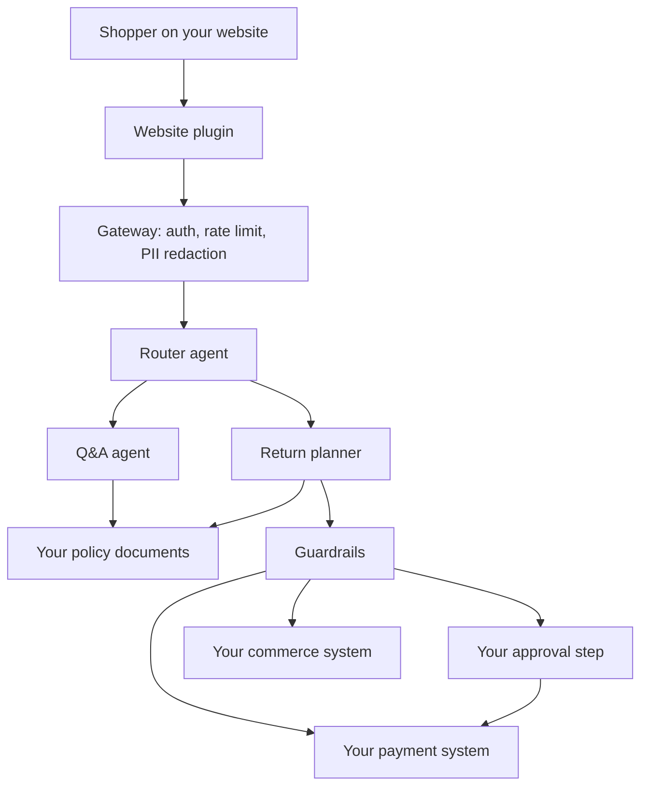

# Ecommerce Agent

Ecommerce Agent is an open-source plugin for a store's own website. It answers customer questions, prepares returns, reconciles settlement, and requests currency quotes. The payment system you already use charges, refunds, settles, and converts currency. This project does not ship a payment account, and it does not store card numbers, bank details, or your provider secrets.

The code is licensed under the [MIT License](LICENSE). Using it in a store is also covered by the [Terms and Conditions](TERMS.md).

## What you connect

| Job | Who does it |
| --- | --- |
| Customer questions | This plugin, using the policy documents you provide |
| Refunds and returns | Your commerce system records the return. Your payment provider sends the money |
| Settlement | Your payment provider captures or reports payouts. This plugin reads that report |
| Currency conversion | Your payment provider quotes the rate and, if you ask, creates the payment |
| Card entry | Your payment provider's checkout. The widget refuses card numbers |

One deployment serves one store. There is no shared customer database in this project.

## Workflow



A language model can phrase policy answers. It cannot call your payment or commerce system. Those calls happen in code, after the guardrails, and only through the plugin you configured.

## Install

```bash
python -m venv .venv
source .venv/bin/activate
pip install -e ".[dev]"
pytest
```

## Try the sample store

The sample uses an in-memory stand-in. It does not move real money.

```bash
export DEMO=1
export PAYMENT_PLUGIN=mock
export COMMERCE_PLUGIN=mock
export APPROVAL_PLUGIN=threshold
export PLUGIN_PUBLIC_TOKEN=public-demo-token
export PLUGIN_SERVER_TOKEN=server-demo-token
python examples/demo.py
python -m ecommerce_agent
```

Open `http://127.0.0.1:8000/demo`. The sample headphones refund is 80.00 USD, so the widget alerts support and waits. Turn `DEMO` off before you point this at a real store.

## Use it in your store

Prefer calling the library from your backend, after your own login check:

```python
from ecommerce_agent import build_agent, load_settings
from ecommerce_agent.models import Caller, Scope, UserRequest
from ecommerce_agent.secrets import EnvSecrets

agent = build_agent(load_settings(), secrets=EnvSecrets())
result = agent.handle(
    UserRequest(
        message="I want to return my headphones",
        order_id="1001",
        customer_ref="cust_1",
        idempotency_key="refund-1001-80",
    ),
    Caller(scope=Scope.SERVER),
)
```

Secrets such as `PAYMENT_API_KEY` stay in the server environment. The library reads them when it calls your provider and does not write them into settings, logs, or traces.

To embed the widget, serve `ecommerce-agent.js` and sign a short-lived grant on your server. The signature uses `PLUGIN_SERVER_TOKEN`, which never goes in the browser. The browser only receives `PLUGIN_PUBLIC_TOKEN` plus the signature. See [docs/plugins.md](docs/plugins.md).

## Payment plugins

| Plugin | Use it when |
| --- | --- |
| `stripe` | Stripe is your payment provider. The adapter uses your Stripe secret key |
| `paystack` | Paystack is your payment provider. The adapter uses your Paystack secret key |
| `flutterwave` | Flutterwave is your payment provider. The adapter can also quote a conversion |
| `shopify` | Shopify Payments is your payment provider, or Shopify is your commerce system |
| `http` | Any other provider. Point this at the byo-v1 adapter you host |
| `mock` | Local demo only |

`http` covers every provider that does not have a built-in adapter. Each provider key stays in its own environment variable. `GET /v1/keys` with the server token reports whether a key is set. It does not return the key.

| Provider | Secret key | Public key, kept out of refund calls |
| --- | --- | --- |
| Stripe | `STRIPE_SECRET_KEY` | `STRIPE_PUBLISHABLE_KEY` |
| Paystack | `PAYSTACK_SECRET_KEY` | `PAYSTACK_PUBLIC_KEY` |
| Flutterwave | `FLUTTERWAVE_SECRET_KEY` | `FLUTTERWAVE_PUBLIC_KEY` |
| Shopify | `SHOPIFY_ADMIN_TOKEN` | |
| Any other payment provider | `PAYMENT_API_KEY` | |
| Your commerce system | `COMMERCE_API_KEY` | |

## Safety defaults

- Public website tokens can ask questions and open a return. They cannot capture a settlement or create a converted payment.
- A refund at or under 50.00 in the order currency can follow your auto-approve rule. A refund above that amount alerts `SUPPORT_ALERT_URL` and waits. Support approves it through `APPROVAL_WEBHOOK_URL`. Change the line with `SUPPORT_ALERT_ABOVE`.
- With no approval webhook, a public return waits. No refund is sent.
- Order ids are checked before they are placed in a URL.
- Retries send an `Idempotency-Key` to your payment provider.
- Refund and payment rules are checked before money moves. Put your organization's rules, policies, and FAQs in `POLICY_DIR`, or upload them with the server token to `POST /v1/policies`. The agent reads those files. Samples in `src/ecommerce_agent/policies/` are used only while that folder is empty.
- Traces keep timings and outcomes. Shopper text is redacted before a model sees it, and it is left out of the default trace export.

## Observability

Every request records five signals: time to first reply, end-to-end latency, fallback recovery, rate-limit errors, and tool-call success. `GET /v1/slis` with the server token returns those signals grouped into latency, reliability, performance, cost, and retrieval quality. See [docs/observability.md](docs/observability.md).

## Project docs

- [Terms and Conditions](TERMS.md)
- [Contributing](CONTRIBUTING.md)
- [Git strategy](docs/git-strategy.md)
- [Architecture](docs/architecture.md)
- [Plugins](docs/plugins.md)
- [Security](SECURITY.md)
