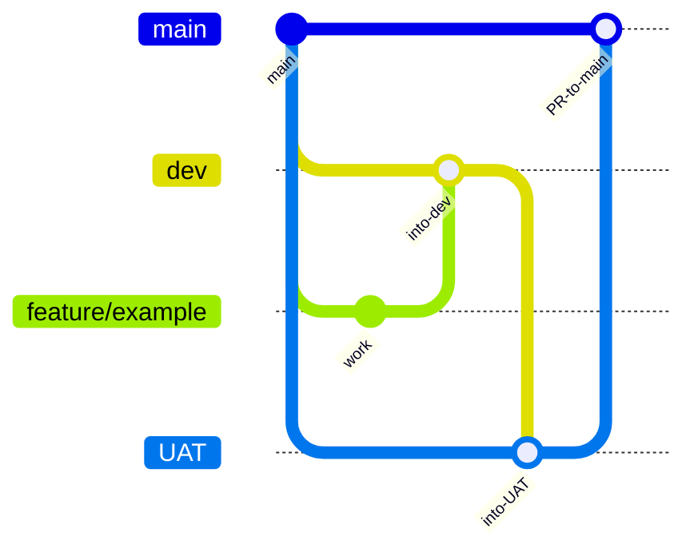

# Git strategy

This repository uses long-lived environment branches and short-lived feature branches. Production releases come from `main`. A GitHub Actions workflow opens a pull request into `main` when `dev`, `UAT`, or a `feature/*` branch is pushed.

## Branches

| Branch | Role |
| --- | --- |
| `main` | Production. Always releasable. Protected. |
| `dev` | Integration branch for ongoing work |
| `UAT` | Acceptance / user-acceptance testing |
| `feature/<short-name>` | A new plugin, endpoint, workflow, or docs change |
| `fix/<short-name>` | A bug fix |
| `docs/<short-name>` | Documentation only |
| `plugin/<provider>` | A payment or commerce adapter |

## Promotion flow

1. Create a `feature/<short-name>` branch from `dev` (or from `main` for a hotfix).
2. Open or merge the feature into `dev` for integration.
3. Promote tested work from `dev` into `UAT` for acceptance.
4. Promote accepted work into `main` for production.

Every push to `dev`, `UAT`, or `feature/**` runs the **Open PR to main** workflow. That workflow creates a pull request targeting `main` when one is not already open for that head branch. CI must still pass on the pull request before merge.

## Pipeline

| Workflow | Trigger | Job |
| --- | --- | --- |
| `CI` | Push to `main`, and every pull request | Install and run `pytest` on Python 3.11 and 3.12 |
| `Open PR to main` | Push to `dev`, `UAT`, or `feature/**` | Create or reuse a pull request into `main` |

## Protection on main

Maintainers turn these on in the host settings:

- Pull request required before merge.
- The CI workflow must pass.
- Linear history. Squash merge is the default.
- Force pushes are disabled.
- Secret scanning and push protection are enabled where the host provides them.

A maintainer may bypass a failing check only to revert a broken merge, and says so in the pull request.

## Commits

Use [Conventional Commits](https://www.conventionalcommits.org/).

| Type | When |
| --- | --- |
| `feat` | Shopper-visible or merchant-visible behavior |
| `fix` | A broken behavior |
| `docs` | Docs only |
| `test` | Tests only |
| `refactor` | Behavior stays the same |
| `chore` | Tooling, CI, or dependencies |

The subject is imperative and specific: `fix: deny public capture of unsettled payments`.

The squash commit on `main` is the message that appears in history. Write that message in the pull request title.

`feat` and `fix` entries are copied into `CHANGELOG.md` before a release.

## Pull requests

A pull request explains:

- why the change is needed
- which plugin or signal it affects
- how it was tested

The template checklist covers secrets, tool access, and docs. Plugin changes include a mocked provider test.

Review looks for the safety checklist in `CONTRIBUTING.md` before style nits. One approving review is enough while the maintainer set is small. The author does not approve their own pull request when another maintainer is available.

## Versioning

Application releases use semantic versioning, tagged `vX.Y.Z` on `main`.

| Bump | Examples |
| --- | --- |
| Patch | A safe bug fix, docs, or a stricter default |
| Minor | A new plugin or an optional field |
| Major | A breaking change to the Python API, the HTTP API, or the byo-v1 contract |

The byo-v1 payment contract is part of the public API. Breaking it requires a new contract name, such as `byo-v2`, and a major version. Additive fields are a minor version. Adapters must ignore fields they do not use.

Deprecations last at least one minor release. The changelog names the replacement and the release that will remove the old behavior.

## Releases

1. `main` is green.
2. Update `CHANGELOG.md` and the version in `pyproject.toml` and `src/ecommerce_agent/version.py`.
3. Merge that release pull request.
4. Tag `vX.Y.Z` on the merge commit and push the tag.
5. Publish the GitHub release from the tag notes in the changelog.

Do not tag a branch that is not `main`.

## What never enters git

- `.env` and real provider keys
- shopper exports, card numbers, and webhook payloads from a live store
- the demo server token, if you replaced the sample value with a real one

`.env.example` lists variable names only. Sample values in that file are placeholders.

If a secret is pushed, rotate it at the provider first. History rewriting on `main` is a last resort, needs every maintainer's agreement, and is a force push, so it is announced before it happens. Rotation is still required because clones may already have the old commit.

## Forks

External contributors fork the repository, push the feature branch to their fork, and open a pull request. Maintainer commits stay on branches in this repository. Nobody pushes directly to `main`.
